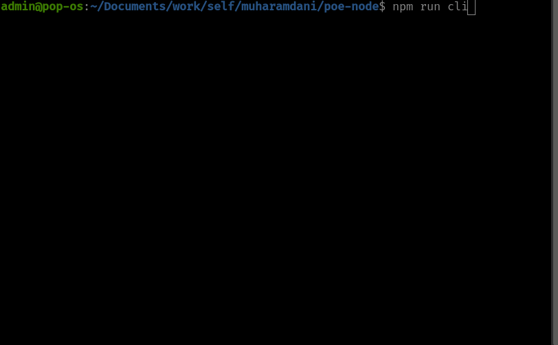
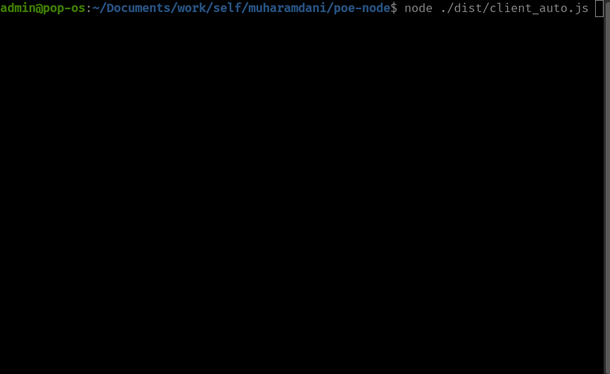
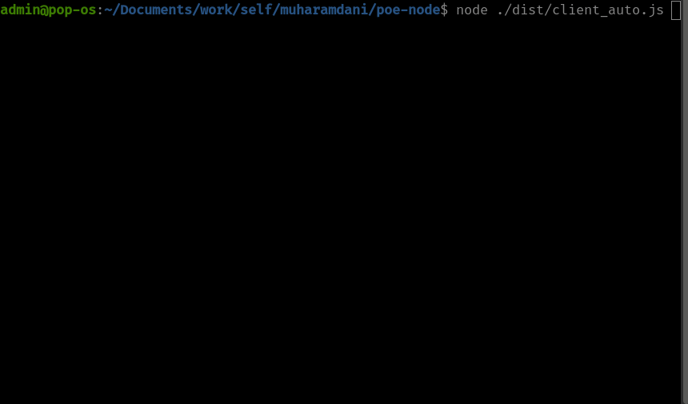
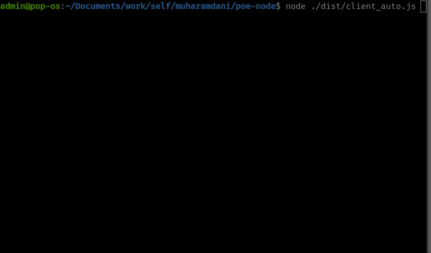

# UPDATE:
30 March 2023: Quora Poe has updated their mail filter, so the auto login feature by Guerrilla Mail as temporary email service is not working anymore. I will try to find another temporary email service to replace it.

# Quora Poe
This is a tool to call the Quora Poe API through GraphQL. It is a work in progress, and currently supports the following:
- Auto login using temporary email, so you don't need to use your own email/phone number.
- Manual login using your own email/phone number, you need to enter the OTP manually.
- Chat with 4 types of bots (Sage, Claude, ChatGPT, and Dragonfly).
- Stream responses support from the bot.
- Clear the chat history.
- Auto re-login after session expires (only for auto login).
- Module support, now you can use this tool as a module.

# Demo's
## CLI
<p>
  
</p>

## Client module (after login)
<p>
  
</p>

## Client module (before login)
<p>
  
</p>

## Client module (auto re-login after session expires)
<p>
  
</p>

## Requirements
- NodeJS 16.0.0 or higher
- NPM

## Installation
- Copy the config.example.json file to config.json
- Run the following command to install the dependencies:

```
npm install
```

## Usage
### Module
Please see file [`./src/client_auto.ts`](./src/client_auto.ts) or [`./src/client_manual.ts`](./src/client_manual.ts) for example.
Or you can try to run the following command:
```
node ./dist/client_auto.js
```
### CLI
```
npm run cli
```
If you don't want stream responses, you can change the `stream_response` variable in the `config.json` file to `false`.

## TODO List
- [ ] Add support for get chat history
- [ ] Add support for delete message

## Notes
- Since I have to work on this project in my free time, I can't guarantee that I will be able to update this project frequently.
- I'm not have much experience with TypeScript, so if you have any suggestions, best practices, or anything, please let me know or create a pull request.
- I'm not publishing this tool to NPM yet. If you want to use this tool as a module, you can clone this repo and build it yourself.
- If you have any questions, please create an issue.

## Contributing
To contribute to this repo, fork it first, then create a new branch, and create a pull request.

## Disclaimer
This tool is not affiliated with Quora in any way. I am not responsible for any misuse of this tool. 
Don't sue me.

Also, please don't use auto login feature to spam the bot, like creating a lot of accounts for any purpose. I don't want this temporary email service to be banned.

## License
[MIT](https://choosealicense.com/licenses/mit/)